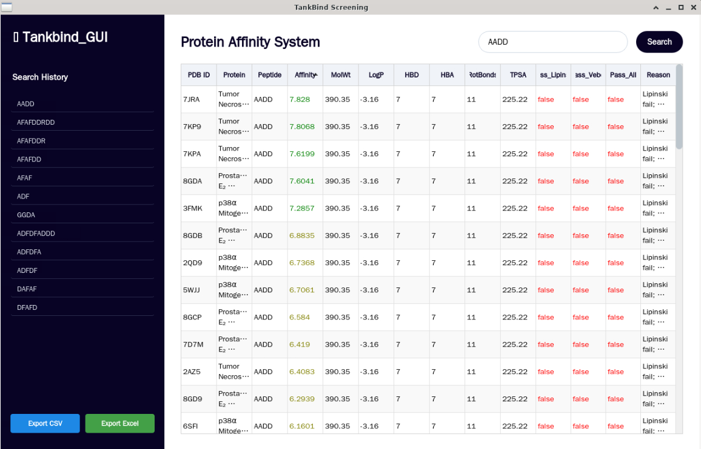

+ # TankBind GUI: 단백질-펩타이드 친화도 예측 및 도킹 시뮬레이션
+
+ > TankBind의 빠른 결합 친화도 예측과 AutoDock Vina의 정밀한 도킹 시뮬레이션을 통합한 연구용 GUI 애플리케이션
+
+ 이 프로그램은 복잡한 명령어 없이 그래픽 인터페이스를 통해 하나의 펩타이드 서열을 다수의 단백질 구조에 대해 스크리닝하고, 높은 친화도를 보이는 후보에 대해 즉시 도킹 시뮬레이션 및 3D 시각화를 수행할 수 있습니다.
+
+ 
+
+ ## 주요 기능
+
+ - **결합 친화도 예측**: [TankBind](https://github.com/luwei0917/TankBind) 모델로 단백질-펩타이드 결합 친화도($pK_d$)를 빠르게 예측.
+ - **다중 타겟 스크리닝**: 단일 펩타이드 서열을 폴더 내 모든 PDB 파일에 대해 일괄 스크리닝.
+ - **ADME/T 예측**: `pipeline.py`로 Lipinski's Rule of Five, Veber's Rule 등 약물 유사성 계산.
+ - **원클릭 도킹 & 시각화**:
+   - [AutoDock Vina](https://vina.scripps.edu/): 결과 테이블에서 버튼 클릭으로 도킹 시뮬레이션 자동 실행.
+   - [PyMOL](https://pymol.org/2/): 도킹 후 단백질-리간드 결합 모습을 `.pse` 파일로 즉시 시각화.
+ - **결과 관리**:
+   - 예측 및 분석 결과를 정렬 가능한 표로 표시.
+   - CSV 또는 Excel 파일로 결과 내보내기.
+   - 검색한 펩타이드 서열을 히스토리에 자동 저장.
+
+ ## 사전 요구사항
+
+ - **Git**: 코드 복제에 필요.
+ - **Anaconda 또는 Miniconda**: Conda 환경 관리에 필요.
+ - **NVIDIA GPU & CUDA Toolkit**: TankBind 모델 최적화 (CUDA 11.8 기반).
+
+ ## 설치 및 실행 방법
+
+ ### 1. 프로젝트 복제
+
+ ```bash
+ git clone https://github.com/ddangkong/tankbind_gui.git
+ cd tankbind_gui
+ ```
+
+ ### 2. Conda 환경 생성 및 활성화
+
+ > **참고**: 아래 명령어로 PyTorch, RDKit, PyMOL, Vina 등 모든 필요한 라이브러리가 포함된 `tankbind-suite` 환경이 생성됩니다. 인터넷 속도에 따라 10~20분 소요될 수 있습니다.
+
+ ```bash
+ conda env create -f environment.yml
+ conda activate tankbind-suite
+ ```
+
+ ### 3. 데이터 준비 (PDB 파일 다운로드)
+
+ - 스크리닝할 단백질의 PDB 파일을 로컬에 저장.
+ - [RCSB Protein Data Bank](https://www.rcsb.org/)에서 다운로드하거나, [PDBe](https://www.ebi.ac.uk/pdbe/) 또는 [PDBj](https://pdbj.org/) 미러 사이트 사용.
+ - 다운로드한 PDB 파일을 다음 단계에서 지정할 폴더에 저장.
+
+ ### 4. 스크립트 내부 경로 설정 (필수)
+
+ > **중요**: 실행 전 `tankbind_gui.py`의 상단 경로 설정을 로컬 환경에 맞게 수정.
+
+ ```python
+ PDB_ROOT = "C:/Users/YourUser/Documents/TestPDBs/"  # PDB 파일 저장 폴더
+ CENTER_PATH = "C:/Users/YourUser/Documents/center_coords.txt"  # 중심 좌표 파일
+ TANKBIND_DIR = "C:/Users/YourUser/Documents/TankBind"  # TankBind 모델 폴더
+ OUT_DIR = "C:/Users/YourUser/Documents/TankBind_Results"  # 결과 저장 폴더
+ ```
+
+ `tankbind-suite` 환경을 사용하므로 `PYMOL_PYTHON`, `AUTODOCK_VINA_EXECUTABLE` 등은 수정 불필요.
+
+ ### 5. 프로그램 실행
+
+ ```bash
+ python tankbind_gui.py
+ ```
+
+ ## 라이선스
+
+ MIT 라이선스. 자세한 내용은 `LICENSE` 파일 참고.
+
+ ## 감사의 말
+
+ - [TankBind](https://github.com/luwei0917/TankBind) 연구팀에 감사.
+ - [RDKit](https://www.rdkit.org/), [PyMOL](https://pymol.org/2/), [AutoDock Vina](https://vina.scripps.edu/) 등 오픈소스 도구에 의존.
+
+ ---
+
+ # TankBind GUI: Protein-Peptide Affinity Prediction and Docking Simulation
+
+ > A research-oriented GUI application integrating TankBind's rapid binding affinity prediction with AutoDock Vina's precise docking simulation.
+
+ This application allows screening a peptide sequence against multiple protein structures via a graphical interface, with immediate docking and 3D visualization for high-affinity candidates.
+
+ 
+
+ ## Key Features
+
+ - **Binding Affinity Prediction**: Uses [TankBind](https://github.com/luwei0917/TankBind) to predict protein-peptide binding affinity ($pK_d$).
+ - **Multi-Target Screening**: Screens a single peptide sequence against all PDB files in a folder.
+ - **ADME/T Prediction**: Calculates drug-likeness (e.g., Lipinski's Rule of Five, Veber's Rule) via `pipeline.py`.
+ - **One-Click Docking & Visualization**:
+   - [AutoDock Vina](https://vina.scripps.edu/): Runs docking simulations with a single click from the results table.
+   - [PyMOL](https://pymol.org/2/): Generates `.pse` files to visualize protein-ligand binding poses post-docking.
+ - **Results Management**:
+   - Displays results in a sortable table.
+   - Exports results to CSV or Excel files.
+   - Saves searched peptide sequences to a history panel.
+
+ ## Prerequisites
+
+ - **Git**: Required to clone the repository.
+ - **Anaconda or Miniconda**: Required for Conda environment management.
+ - **NVIDIA GPU & CUDA Toolkit**: Optimized for TankBind (CUDA 11.8-based).
+
+ ## Installation and Usage
+
+ ### 1. Clone the Project
+
+ ```bash
+ git clone https://github.com/ddangkong/tankbind_gui.git
+ cd tankbind_gui
+ ```
+
+ ### 2. Create and Activate the Conda Environment
+
+ > **Note**: The command below creates a `tankbind-suite` environment with all required libraries (PyTorch, RDKit, PyMOL, Vina, etc.). This may take 10-20 minutes.
+
+ ```bash
+ conda env create -f environment.yml
+ conda activate tankbind-suite
+ ```
+
+ ### 3. Data Preparation (Download PDB Files)
+
+ - Store target protein PDB files locally.
+ - Download from [RCSB Protein Data Bank](https://www.rcsb.org/) or mirror sites like [PDBe](https://www.ebi.ac.uk/pdbe/) or [PDBj](https://pdbj.org/).
+ - Place PDB files in the folder specified for `PDB_ROOT` in the next step.
+
+ ### 4. Configure Paths in the Script (Required)
+
+ > **Important**: Edit `tankbind_gui.py` to set paths for your local system.
+
+ ```python
+ PDB_ROOT = "C:/Users/YourUser/Documents/TestPDBs/"  # Folder for PDB files
+ CENTER_PATH = "C:/Users/YourUser/Documents/center_coords.txt"  # Center coordinates file
+ TANKBIND_DIR = "C:/Users/YourUser/Documents/TankBind"  # TankBind model folder
+ OUT_DIR = "C:/Users/YourUser/Documents/TankBind_Results"  # Results output folder
+ ```
+
+ No need to modify `PYMOL_PYTHON` or `AUTODOCK_VINA_EXECUTABLE` with the `tankbind-suite` environment.
+
+ ### 5. Run the Application
+
+ ```bash
+ python tankbind_gui.py
+ ```
+
+ ## License
+
+ MIT License. See the `LICENSE` file for details.
+
+ ## Acknowledgments
+
+ - Thanks to the [TankBind](https://github.com/luwei0917/TankBind) research team.
+ - Relies on open-source tools like [RDKit](https://www.rdkit.org/), [PyMOL](https://pymol.org/2/), and [AutoDock Vina](https://vina.scripps.edu/).

- TankBind GUI: 단백질-펩타이드 친화도 예측 및 도킹 시뮬레이션
- TankBind의 빠른 결합 친화도 예측과 AutoDock Vina의 정밀한 도킹 시뮬레이션을 통합한 연구용 GUI 애플리케이션
- 
- 이 프로그램은 복잡한 명령어 없이 그래픽 인터페이스를 통해 하나의 펩타이드 서열을 다수의 단백질 구조에 대해 스크리닝하고, 높은 친화도를 보이는 후보에 대해 즉시 도킹 시뮬레이션 및 3D 시각화를 수행할 수 있습니다.
- 
- 스크린샷
- 
- 주요 기능
- 결합 친화도 예측: TankBind 모델로 단백질-펩타이드 결합 친화도(p K d)를 빠르게 예측.
- 다중 타겟 스크리닝: 단일 펩타이드 서열을 폴더 내 모든 PDB 파일에 대해 일괄 스크리닝.
- ADME/T 예측: pipeline.py로 Lipinski's Rule of Five, Veber's Rule 등 약물 유사성 계산.
- 원클릭 도킹 & 시각화:
- AutoDock Vina: 결과 테이블에서 버튼 클릭으로 도킹 시뮬레이션 자동 실행.
- PyMOL: 도킹 후 단백질-리간드 결합 모습을 .pse 파일로 즉시 시각화.
- 결과 관리:
- 예측 및 분석 결과를 정렬 가능한 표로 표시.
- CSV 또는 Excel 파일로 결과 내보내기.
- 검색한 펩타이드 서열을 히스토리에 자동 저장.
- 사전 요구사항
- Git: 코드 복제에 필요.
- Anaconda 또는 Miniconda: Conda 환경 관리에 필요.
- NVIDIA GPU & CUDA Toolkit: TankBind 모델 최적화 (CUDA 11.8 기반).
- 설치 및 실행 방법
- 1. 프로젝트 복제
- git clone https://github.com/ddangkong/tankbind_gui.git
- cd tankbind_gui
- 2. Conda 환경 생성 및 활성화
- 참고: 아래 명령어로 PyTorch, RDKit, PyMOL, Vina 등 모든 필요한 라이브러리가 포함된 tankbind-suite 환경이 생성됩니다. 인터넷 속도에 따라 10~20분 소요될 수 있습니다.
- 
- bash
- 
- 접기
- 
- 자동 줄바꿈
- 
- 실행
- 
- 복사
- conda env create -f environment.yml
- conda activate tankbind-suite
- 3. 데이터 준비 (PDB 파일 다운로드)
- 스크리닝할 단백질의 PDB 파일을 로컬에 저장.
- RCSB Protein Data Bank에서 다운로드하거나, PDBe 또는 PDBj 미러 사이트 사용.
- 다운로드한 PDB 파일을 다음 단계에서 지정할 폴더에 저장.
- 4. 스크립트 내부 경로 설정 (필수)
- 중요: 실행 전 tankbind_gui.py의 상단 경로 설정을 로컬 환경에 맞게 수정.
- 
- python
- 
- 접기
- 
- 자동 줄바꿈
- 
- 실행
- 
- 복사
- PDB_ROOT = "C:/Users/YourUser/Documents/TestPDBs/"  # PDB 파일 저장 폴더
- CENTER_PATH = "C:/Users/YourUser/Documents/center_coords.txt"  # 중심 좌표 파일
- TANKBIND_DIR = "C:/Users/YourUser/Documents/TankBind"  # TankBind 모델 폴더
- OUT_DIR = "C:/Users/YourUser/Documents/TankBind_Results"  # 결과 저장 폴더
- tankbind-suite 환경을 사용하므로 PYMOL_PYTHON, AUTODOCK_VINA_EXECUTABLE 등은 수정 불필요.
- 
- 5. 프로그램 실행
- bash
- 
- 접기
- 
- 자동 줄바꿈
- 
- 실행
- 
- 복사
- python tankbind_gui.py
- 라이선스
- MIT 라이선스. 자세한 내용은 LICENSE 파일 참고.
- 
- 감사의 말
- TankBind 연구팀에 감사.
- RDKit, PyMOL, AutoDock Vina 등 오픈소스 도구에 의존.
- TankBind GUI: Protein-Peptide Affinity Prediction and Docking Simulation
- A research-oriented GUI application integrating TankBind's rapid binding affinity prediction with AutoDock Vina's precise docking simulation.
- 
- This application allows screening a peptide sequence against multiple protein structures via a graphical interface, with immediate docking and 3D visualization for high-affinity candidates.
- 
- 
- 
- Key Features
- Binding Affinity Prediction: Uses TankBind to predict protein-peptide binding affinity ($pK_d$).
- Multi-Target Screening: Screens a single peptide sequence against all PDB files in a folder.
- ADME/T Prediction: Calculates drug-likeness (e.g., Lipinski's Rule of Five, Veber's Rule) via pipeline.py.
- One-Click Docking & Visualization:
- AutoDock Vina: Runs docking simulations with a single click from the results table.
- PyMOL: Generates .pse files to visualize protein-ligand binding poses post-docking.
- Results Management:
- Displays results in a sortable table.
- Exports results to CSV or Excel files.
- Saves searched peptide sequences to a history panel.
- Prerequisites
- Git: Required to clone the repository.
- Anaconda or Miniconda: Required for Conda environment management.
- NVIDIA GPU & CUDA Toolkit: Optimized for TankBind (CUDA 11.8-based).
- Installation and Usage
- 1. Clone the Project
- bash
- 
- 접기
- 
- 자동 줄바꿈
- 
- 실행
- 
- 복사
- git clone https://github.com/ddangkong/tankbind_gui.git
- cd tankbind_gui
- 2. Create and Activate the Conda Environment
- Note: The command below creates a tankbind-suite environment with all required libraries (PyTorch, RDKit, PyMOL, Vina, etc.). This may take 10-20 minutes.
- 
- bash
- 
- 접기
- 
- 자동 줄바꿈
- 
- 실행
- 
- 복사
- conda env create -f environment.yml
- conda activate tankbind-suite
- 3. Data Preparation (Download PDB Files)
- Store target protein PDB files locally.
- Download from RCSB Protein Data Bank or mirror sites like PDBe or PDBj.
- Place PDB files in the folder specified for PDB_ROOT in the next step.
- 4. Configure Paths in the Script (Required)
- Important: Edit tankbind_gui.py to set paths for your local system.
- 
- python
- 
- 접기
- 
- 자동 줄바꿈
- 
- 실행
- 
- 복사
- PDB_ROOT = "C:/Users/YourUser/Documents/TestPDBs/"  # Folder for PDB files
- CENTER_PATH = "C:/Users/YourUser/Documents/center_coords.txt"  # Center coordinates file
- TANKBIND_DIR = "C:/Users/YourUser/Documents/TankBind"  # TankBind model folder
- OUT_DIR = "C:/Users/YourUser/Documents/TankBind_Results"  # Results output folder
- No need to modify PYMOL_PYTHON or AUTODOCK_VINA_EXECUTABLE with the tankbind-suite environment.
- 
- 5. Run the Application
- bash
- 
- 접기
- 
- 자동 줄바꿈
- 
- 실행
- 
- 복사
- python tankbind_gui.py
- License
- MIT License. See the LICENSE file for details.
- 
- Acknowledgments
- Thanks to the TankBind research team.
- Relies on open-source tools like RDKit, PyMOL, and AutoDock Vina.
